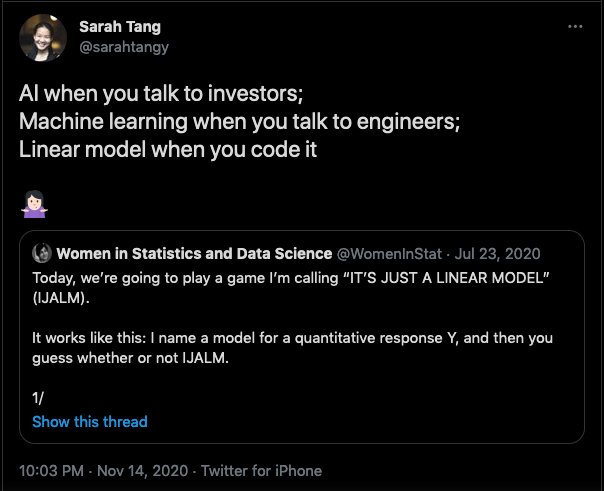

```{r setup, include = FALSE}
library(knitr)
```
 
<!-- ************************************************************************ -->
# Student t tests
<!-- ************************************************************************ -->

## Penguins {.smaller}

Penguins from the Palmer Archipelago in Antartica,
see [palmerpenguins](https://allisonhorst.github.io/palmerpenguins/).

```{r}
library(palmerpenguins)
kable(head(penguins))
```

## Subset {.smaller}

We keep only the penguins of species "Adelie", and remove missing data.

```{r}
adelie <- subset(penguins, species == "Adelie")
adelie <- na.omit(adelie)
kable(head(adelie))
```

## Group Comparison {.build}

**Question**: Are *male* adelie penguins heavier than *female* adelie penguins ?

```{r, fig.height=3.5, fig.width=7, fig.align='center'}
par(mfrow = c(1, 2), mar = c(5, 4, 2, 2) + 0.1)
plot(adelie$body_mass_g, col = adelie$sex)      ## scatter plot
boxplot(body_mass_g ~ sex, data = adelie)       ## box plot
```

## Simple $t$ test

```{r}
mass_females <- subset(adelie, sex == "female")$body_mass_g
mass_males <- subset(adelie, sex == "male")$body_mass_g
t.test(mass_males, mass_females, var.equal = TRUE)
```

## Simple $t$ test {.build}

**Data**:

* $n_f$ female adelie penguins, $n_m$ male adelie penguins
* $y^f_{i}$: mass (g) of a female adelie penguin, $1 \leq i \leq n_f$
* $y^m_{j}$: mass (g) of a male adelie penguin, $1 \leq j \leq n_m$

**Assumption**:

* $y^f_{i} \sim \mathcal{N}(\mu_f, \sigma^2)$ iid
* $y^m_{j} \sim \mathcal{N}(\mu_m, \sigma^2)$ iid

**Test**:

$\mathcal{H}_0$: $\mu_f = \mu_m$ vs $\mathcal{H}_1$: $\mu_f \neq \mu_m$

## Simple $t$ test {.build}

**Test**:

$\mathcal{H}_0$: $\mu_f = \mu_m$ vs $\mathcal{H}_1$: $\mu_f \neq \mu_m$

**Test Statistic**:

$$
T = \frac{\bar{\mathbf{y}}^f - \bar{\mathbf{y}}^m}{s_p \sqrt{\frac{1}{n_f} + \frac{1}{n_m}}}
\underset{\mathcal{H}_0}{\sim} \mathcal{T}_{n_f + n_m - 2}
$$
with the "pooled" standard deviation:
$$
s_p = \sqrt{\frac{(n_f-1)s^2_{\mathbf{y}^f} + (n_m-1)s^2_{\mathbf{y}^m}}{n_f + n_m - 2}}
$$

## Simple $t$ test

```{r testplot, echo=FALSE, fig.height=5, fig.width=7, fig.align='center'}
n <- nrow(adelie)
p <- 2
ccc <- hcl.colors(5)
### Student Distribution
x <- -5500:5500 / 1000
# 1
p <- n - p
plot(x, dt(x, p), type = "l", ylab = "density", ylim = c(0, 0.4), col = ccc[1], lwd = 2, xlab = "")
abline(h = 0)
# quantiles for 1 - alp = 95% interval
alp <- 0.1
quants <- qt(c(alp / 2, 1 - alp / 2), p)
segments(x0 = quants, y0 = -1, x1 = quants, y1 = dt(0, p), lty = 2, col = ccc[3])
axis(side = 1, at = quants, labels = c(expression(t[n[f]+n[m]-2]^(alpha/2)), expression(t[n[f]+n[m]-2]^(1 - alpha/2))), col.ticks = ccc[3], col.axis = ccc[3], las = 1, padj = 1.2)
# Color area under the curve
x_inf <- -5500:(quants[1]*1000)/1000
polygon(c(x_inf, rev(x_inf)),
        c(dt(x_inf, p), rep(0, length(x_inf))),
        col = ccc[5], border = NA, density = 20)
x_sup <- (quants[2]*1000):5500/1000
polygon(c(x_sup, rev(x_sup)),
        c(dt(x_sup, p), rep(0, length(x_sup))),
        col = ccc[5], border = NA, density = 20)
# legend
legend("topright",
       c(expression(T[n[f]+n[m]-2])),
       col = ccc[1],
       lwd = 2, lty = 1)
```

## Simple $t$ test

```{r}
t.test(mass_males, mass_females, var.equal = TRUE)
```

Reject the null that $\mu_f = \mu_m$ : males and females have different body masses.

<!-- ************************************************************************ -->
# Linear Regression
<!-- ************************************************************************ -->

## Model {.build}

**Assumptions**:

* $y^f_{i} \sim \mathcal{N}(\mu_f, \sigma^2)$ iid
* $y^m_{j} \sim \mathcal{N}(\mu_m, \sigma^2)$ iid

in other words:

* $y^f_{i} = \mu_f + \epsilon_i^f$, with $\epsilon^f_i \sim \mathcal{N}(0, \sigma^2)$ iid
* $y^m_{j} = \mu_m + \epsilon_j^m$, with $\epsilon^m_j \sim \mathcal{N}(0, \sigma^2)$ iid

Can we write this as a linear model: "$\mathbf{y} = \mathbf{X}\boldsymbol{\beta} + \boldsymbol{\epsilon}$" ?

## Model {.build}

Write:
$$
\mathbf{y} = 
\begin{pmatrix}
\mathbf{y}^f \\
\mathbf{y}^m \\
\end{pmatrix}
\quad
\text{and}
\quad
\boldsymbol{\epsilon} = 
\begin{pmatrix}
\boldsymbol{\epsilon}^f \\
\boldsymbol{\epsilon}^m \\
\end{pmatrix}
$$
$\mathbf{y}$ and $\boldsymbol{\epsilon}$ vectors of size $n = n_f + n_m$.

Then, for $1 \leq i \leq n$:
$$
y_i = \mu_k + \epsilon_i
\quad
\text{with}
\quad
\begin{cases}
\mu_k  = \mu_f & \text{if } 1 \leq i \leq n_f\\
\mu_k  = \mu_m & \text{if } n_f+1 \leq i \leq n_f + n_m
\end{cases}
$$

Regression matrix $\mathbf{X}$ ?

## Linear Model {.build .smaller}

$$
\text{Write:}
\qquad
\mathbf{X} = 
\begin{pmatrix}
1 & 0 \\
\vdots & \vdots \\
1 & 0 \\
0 & 1 \\
\vdots & \vdots\\
0 & 1 \\
\end{pmatrix}
\begin{matrix}
 \\
n_f\\
 \\
 \\
n_m\\
\\
\end{matrix}
\qquad
\text{and}
\qquad
\boldsymbol{\beta} = 
\begin{pmatrix}
\mu_f \\
\mu_m \\
\end{pmatrix}
$$

$$
\text{Then:}
\qquad
\mathbf{X}\boldsymbol{\beta} 
=
\begin{pmatrix}
\mu_f + 0\\
\vdots \\
\mu_f + 0\\
0 + \mu_m\\
\vdots\\
0 + \mu_m \\
\end{pmatrix}
=
\begin{pmatrix}
\mu_f \\
\vdots \\
\mu_f \\
\mu_m \\
\vdots\\
\mu_m \\
\end{pmatrix}
\begin{matrix}
 \\
n_f\\
 \\
 \\
n_m\\
\\
\end{matrix}
$$

## Linear Model {.build}

Hence, the model can be written as:
$$
\begin{pmatrix}
y^f_1 \\
\vdots\\
y^f_{n_f} \\
y^m_{1} \\
\vdots\\
y^m_{n_m} \\
\end{pmatrix}
=
\begin{pmatrix}
1 & 0 \\
\vdots & \vdots \\
1 & 0 \\
0 & 1 \\
\vdots & \vdots\\
0 & 1 \\
\end{pmatrix}
\begin{pmatrix}
\mu_f \\
\mu_m \\
\end{pmatrix}
+
\begin{pmatrix}
\epsilon^f_1 \\
\vdots\\
\epsilon^f_{n_f} \\
\epsilon^m_{1} \\
\vdots\\
\epsilon^m_{n_m} \\
\end{pmatrix}
$$

i.e:
$$
\mathbf{y} = \mathbf{X}\boldsymbol{\beta} + \boldsymbol{\epsilon} 
\quad \text{with} \quad \boldsymbol{\epsilon} \sim \mathcal{N}(\mathbf{0}, \sigma^2 \mathbf{I}_n)
$$

$\to$ classical linear model with Gaussian assumption !


## Linear Model - With Intercept {.build .smaller}

$$
\text{Write:}
\qquad
\mathbf{X} = 
\begin{pmatrix}
1 & 0 \\
\vdots & \vdots \\
1 & 0 \\
1 & 1 \\
\vdots & \vdots\\
1 & 1 \\
\end{pmatrix}
\begin{matrix}
 \\
n_f\\
 \\
 \\
n_m\\
\\
\end{matrix}
\qquad
\text{and}
\qquad
\boldsymbol{\beta} = 
\begin{pmatrix}
\mu_f \\
\mu_m - \mu_f \\
\end{pmatrix}
$$

$$
\text{Then:}
\qquad
\mathbf{X}\boldsymbol{\beta} 
=
\begin{pmatrix}
\mu_f + 0\\
\vdots \\
\mu_f + 0\\
\mu_f + \mu_m - \mu_f\\
\vdots\\
\mu_f + \mu_m - \mu_f \\
\end{pmatrix}
=
\begin{pmatrix}
\mu_f \\
\vdots \\
\mu_f \\
\mu_m \\
\vdots\\
\mu_m \\
\end{pmatrix}
\begin{matrix}
 \\
n_f\\
 \\
 \\
n_m\\
\\
\end{matrix}
$$

## Linear Model - With Intercept

The model can also be written as:
$$
\begin{pmatrix}
y^f_1 \\
\vdots\\
y^f_{n_f} \\
y^m_{1} \\
\vdots\\
y^m_{n_m} \\
\end{pmatrix}
=
\begin{pmatrix}
1 & 0 \\
\vdots & \vdots \\
1 & 0 \\
1 & 1 \\
\vdots & \vdots\\
1 & 1 \\
\end{pmatrix}
\begin{pmatrix}
\mu_f \\
\mu_m - \mu_f \\
\end{pmatrix}
+
\begin{pmatrix}
\epsilon^f_1 \\
\vdots\\
\epsilon^f_{n_f} \\
\epsilon^m_{1} \\
\vdots\\
\epsilon^m_{n_m} \\
\end{pmatrix}
$$

i.e:
$$
\mathbf{y} = \mathbf{X}\boldsymbol{\beta} + \boldsymbol{\epsilon} 
\quad \text{with} \quad \boldsymbol{\epsilon} \sim \mathcal{N}(\mathbf{0}, \sigma^2 \mathbf{I}_n)
$$

$\to$ parametrization used in `R`

## Linear Model - $t$ test {.build}

$$
\mathbf{y} = \mathbf{X}\boldsymbol{\beta} + \boldsymbol{\epsilon} 
\quad \text{with} \quad \boldsymbol{\epsilon} \sim \mathcal{N}(\mathbf{0}, \sigma^2 \mathbf{I}_n)
$$

As 
$$
\boldsymbol{\beta} =
\begin{pmatrix}
\mu_f \\
\mu_m - \mu_f \\
\end{pmatrix},
$$

the test
$$
\mathcal{H}_0: \mu_f = \mu_m \quad \text{vs} \quad \mathcal{H}_1: \mu_f \neq \mu_m
$$

becomes:
$$
\mathcal{H}_0: \beta_2 = 0 \quad \text{vs} \quad \mathcal{H}_1: \beta_2 \neq 0
$$

$\to$ $t$-test on the $\beta_2$ coefficient !

## Linear Model {.build}

```{r}
fit <- lm(body_mass_g ~ sex, data = adelie)
```

```{r}
model.matrix(fit)[1:10, ]
```

## Linear Model {.smaller}

```{r}
summary(fit)
```

## Simple $t$ test {.smaller}

```{r}
t.test(mass_males, mass_females, var.equal = TRUE)
```


## Test statistics {.smaller .build}

**Simple $t$ test**:
$$
T = \frac{\bar{\mathbf{y}}^f - \bar{\mathbf{y}}^m}{s_p \sqrt{\frac{1}{n_f} + \frac{1}{n_m}}}
\underset{\mathcal{H}_0}{\sim} \mathcal{T}_{n_f + n_m - 2}
\quad
\text{with}
\quad
s_p = \sqrt{\frac{(n_f-1)s^2_{\mathbf{y}^f} + (n_m-1)s^2_{\mathbf{y}^m}}{n_f + n_m - 2}}
$$

**Linear Regression**:
$$
\frac{\hat{\beta}_k - \beta_k}{\sqrt{\hat{\sigma}^2 [(\mathbf{X}^T\mathbf{X})^{-1}]_{kk}}}
\sim
\mathcal{T}_{n-p}
$$
with
$$
p = 2
\qquad
n = n_f + n_m
\qquad
\beta_2 = 0 \text{ under } \mathcal{H}_0
$$

i.e.
$$
\frac{\hat{\beta}_2}{\sqrt{\hat{\sigma}^2 [(\mathbf{X}^T\mathbf{X})^{-1}]_{22}}}
\underset{\mathcal{H}_0}{\sim} \mathcal{T}_{n_f + n_m - 2}
$$

## Test statistics {.smaller}

Let's show that:
$$
\frac{\hat{\beta}_2}{\sqrt{\hat{\sigma}^2 [(\mathbf{X}^T\mathbf{X})^{-1}]_{22}}}
\quad
\text{with}
\quad
\mathbf{X} = 
\begin{pmatrix}
1 & 0 \\
\vdots & \vdots \\
1 & 0 \\
1 & 1 \\
\vdots & \vdots\\
1 & 1 \\
\end{pmatrix}
\begin{matrix}
 \\
n_f\\
 \\
 \\
n_m\\
\\
\end{matrix}
\qquad
\text{and}
\qquad
\boldsymbol{\beta} = 
\begin{pmatrix}
\mu_f \\
\mu_m - \mu_f \\
\end{pmatrix}
$$

is equal to 
$$
\frac{\bar{\mathbf{y}}^f - \bar{\mathbf{y}}^m}{s_p \sqrt{\frac{1}{n_f} + \frac{1}{n_m}}}
\quad
\text{with}
\quad
s_p = \sqrt{\frac{(n_f-1)s^2_{\mathbf{y}^f} + (n_m-1)s^2_{\mathbf{y}^m}}{n_f + n_m - 2}}
$$


## Test statistics - Proof - 1/5 {.smaller .build}

$$
\mathbf{X}^T\mathbf{X} = 
\begin{pmatrix}
1 & \cdots & 1 & 1 & \cdots & 1 \\
0 & \cdots & 0 & 1 & \cdots & 1 \\
\end{pmatrix}
\begin{pmatrix}
1 & 0 \\
\vdots & \vdots \\
1 & 0 \\
1 & 1 \\
\vdots & \vdots\\
1 & 1 \\
\end{pmatrix}
=
\begin{pmatrix}
n & n_m \\
n_m & n_m
\end{pmatrix}
$$

Hence:
$$
(\mathbf{X}^T\mathbf{X})^{-1}
=
\begin{pmatrix}
n & n_m \\
n_m & n_m
\end{pmatrix}^{-1}
=
\frac{1}{nn_m - n_m^2}
\begin{pmatrix}
n_m & -n_m \\
-n_m & n
\end{pmatrix}
$$

And:
$$
[(\mathbf{X}^T\mathbf{X})^{-1}]_{22} 
= \frac{n}{nn_m - n_m^2}
= \frac{n_f + n_m}{(n - n_m)n_m}
= \frac{n_f + n_m}{n_f n_m}
= \frac{1}{n_f} + \frac{1}{n_m}
$$

## Test statistics - Proof - 2/5 {.smaller .build}

$$
\hat{\boldsymbol{\beta}} 
= (\mathbf{X}^{T}\mathbf{X})^{-1}\mathbf{X}^{T}\mathbf{y}
$$

But:
$$
\mathbf{X}^{T}\mathbf{y}
=
\begin{pmatrix}
1 & \cdots & 1 & 1 & \cdots & 1 \\
0 & \cdots & 0 & 1 & \cdots & 1 \\
\end{pmatrix}
\mathbf{y}
=
\begin{pmatrix}
\sum_{i = 1}^n y_i\\
\sum_{j = 1}^{n_m} y^m_j
\end{pmatrix}
$$

Hence:
$$
\begin{aligned}
\hat{\boldsymbol{\beta}} 
& = (\mathbf{X}^{T}\mathbf{X})^{-1}\mathbf{X}^{T}\mathbf{y}
= 
\frac{1}{n_fn_m}
\begin{pmatrix}
n_m & -n_m \\
-n_m & n
\end{pmatrix}
\begin{pmatrix}
\sum_{i = 1}^n y_i\\
\sum_{j = 1}^{n_m} y^m_j
\end{pmatrix} \\
&=
%\frac{1}{n_fn_m}
%\begin{pmatrix}
%n_m\sum_{i = 1}^n y_i - n_m\sum_{j = 1}^{n_m} y^m_j\\
%- n_m\sum_{i = 1}^{n} y_i + n\sum_{j = 1}^{n_m} y^m_j\\
%\end{pmatrix}
%=
\frac{1}{n_fn_m}
\begin{pmatrix}
n_m\sum_{i = 1}^n y_i - n_m\sum_{j = 1}^{n_m} y^m_j\\
- n_m\sum_{i = 1}^{n} y_i + n_m\sum_{j = 1}^{n_m} y^m_j + n_f\sum_{j = 1}^{n_m} y^m_j\\
\end{pmatrix} \\
&=
\frac{1}{n_fn_m}
\begin{pmatrix}
n_m \sum_{i = 1}^{n_f} y^f_i\\
- n_m\sum_{i = 1}^{n_f} y^f_i + n_f\sum_{j = 1}^{n_m} y^m_j\\
\end{pmatrix}
\end{aligned}
$$

## Test statistics - Proof - 3/5 {.smaller .build}

$$
\hat{\boldsymbol{\beta}} 
= (\mathbf{X}^{T}\mathbf{X})^{-1}\mathbf{X}^{T}\mathbf{y}
$$


And:
$$
\hat{\boldsymbol{\beta}} 
=
\frac{1}{n_fn_m}
\begin{pmatrix}
n_m \sum_{i = 1}^{n_f} y^f_i\\
- n_m\sum_{i = 1}^{n_f} y^f_i + n_f\sum_{j = 1}^{n_m} y^m_j\\
\end{pmatrix}
=
\begin{pmatrix}
\bar{\mathbf{y}}^f\\
-\bar{\mathbf{y}}^f + \bar{\mathbf{y}}^m\\
\end{pmatrix}
$$

*Note*:
$$
\text{since }
\quad
\boldsymbol{\beta} = 
\begin{pmatrix}
\mu_f \\
\mu_m - \mu_f \\
\end{pmatrix}
\quad
\text{this result is coherent.}
$$

*Note*:
$$
\text{As}
\quad
\mathbf{x}^{i} =
\begin{cases}
(1~0) & \text{ if  $i$ female} \\
(1~1) & \text{ if  $i$ male} \\
\end{cases}
\quad
\text{we get:}
\quad
\hat{y}_i = \mathbf{x}^{i}\hat{\boldsymbol{\beta}} =
\begin{cases}
\bar{\mathbf{y}}^f & \text{ if  $i$ female} \\
\bar{\mathbf{y}}^m & \text{ if  $i$ male} \\
\end{cases}
$$

## Test statistics - Proof - 4/5 {.smaller .build}

$$
\hat{\sigma}^2 = \frac{1}{n - 2}\sum_{i = 1}^n (y_i -  \hat{y}_i)^2
$$

Hence:
$$
\hat{\sigma}^2 = \frac{1}{n_f + n_m - 2} 
\left[
\sum_{i = 1}^{n_f} (y^f_i -  \bar{\mathbf{y}}^f)^2 + 
\sum_{i = 1}^{n_m} (y^m_i -  \bar{\mathbf{y}}^m)^2
\right]
$$

Recall:
$$
s^2_p = \frac{(n_f-1)s^2_{\mathbf{y}^f} + (n_m-1)s^2_{\mathbf{y}^m}}{n_f + n_m - 2}
$$

hence:
$$
\hat{\sigma}^2 = s^2_p.
$$

## Test statistics - Proof - 5/5 {.smaller .build}

$$
T = \frac{\hat{\beta}_2}{\sqrt{\hat{\sigma}^2 [(\mathbf{X}^T\mathbf{X})^{-1}]_{22}}}
$$

but:
$$
\hat{\beta}_2 = \bar{\mathbf{y}}^m -\bar{\mathbf{y}}^f \\
\hat{\sigma}^2 = s^2_p \\
[(\mathbf{X}^T\mathbf{X})^{-1}]_{22} = \frac{1}{n_f} + \frac{1}{n_m}
$$

hence:
$$
T = \frac{\bar{\mathbf{y}}^f - \bar{\mathbf{y}}^m}{s_p \sqrt{\frac{1}{n_f} + \frac{1}{n_m}}}
$$

And the simple $t$-test is the same as the $t$-test on the coefficient of the linear regression.

## Summary {.smaller .build}

**Group comparison**:

* $n_f$ female adelie penguins, $n_m$ male adelie penguins
* $y^f_{i}$: mass (g) of a female adelie penguin, $1 \leq i \leq n_f$, $y^f_{i} \sim \mathcal{N}(\mu_f, \sigma^2)$ iid
* $y^m_{j}$: mass (g) of a male adelie penguin, $1 \leq j \leq n_m$, $y^m_{j} \sim \mathcal{N}(\mu_m, \sigma^2)$ iid
* $\mathcal{H}_0$: $\mu_f = \mu_m$ vs $\mathcal{H}_1$: $\mu_f \neq \mu_m$

is the same as a
**Linear model** with:

* $\mathbf{y} = \mathbf{X}\boldsymbol{\beta} + \boldsymbol{\epsilon}$ with $\boldsymbol{\epsilon} \sim \mathcal{N}(\mathbf{0}, \sigma^2 \mathbf{I}_n)$
* $\mathbf{X}_1 = \mathbb{1}_n$ and $\mathbf{X}_2 = \mathbb{1}(male)$
* $\beta_1 = \mu_f$ and $\beta_2 = \mu_m - \mu_f$.
* $\mathcal{H}_0: \beta_2 = 0$ vs $\mathcal{H}_1: \beta_2 \neq 0$

$\to$ what happens when there are more than two groups ?

<!-- ************************************************************************ -->
# One-way ANOVA
<!-- ************************************************************************ -->

## Species {.smaller}

We keep only the females penguins of any species, and remove missing data.

```{r}
females <- subset(penguins, sex == "female")
females <- na.omit(females)
kable(females[c(1, 2, 101, 102, 151, 152), ])
```

## Species

**Question**: are the females of each species of different body mass ?

```{r, fig.height=3.5, fig.width=7, fig.align='center'}
par(mfrow = c(1, 2), mar = c(5, 4, 2, 2) + 0.1)
plot(females$body_mass_g, col = females$species)     ## scatter plot
boxplot(body_mass_g ~ species, data = females)       ## box plot
```


## $t$ tests

Pairwise $t$ tests:

```{r, fig.height=4, fig.width=6, fig.align='center'}
pairwise.t.test(females$body_mass_g, females$species,
                p.adjust.method = "none")
```

$\to$ ${K \choose 2}$ tests : Multiple testing problems.

## $t$ tests - Model {.build}

**Model**:

* $n_s$ penguins, for species $s \in S = \{adelie, chins, gentoo\}$
* $y^s_{i}$: mass (g) of a female penguin of species $s$, $1 \leq i \leq n_s$
* $y^s_{i} \sim \mathcal{N}(\mu_s, \sigma^2)$ iid for any species $s$.

**Pairwise Tests**:

$\mathcal{H}^{s_1,s_2}_0$: $\mu_{s_1} = \mu_{s_2}$ vs $\mathcal{H}^{s_1,s_2}_1$: $\mu_{s_1} \neq \mu_{s_2}$  
for any pair $(s_1,s_2)$ of species.
<!-- $\to$ ${|S| \choose 2 }$ tests. -->

**Global Tests** can we do:

$\mathcal{H}_0$: $\mu_a = \mu_c = \mu_g$ vs $\mathcal{H}_1$: $\exists s_1, s_2 \in S ~|~ \mu_{s_1} \neq \mu_{s_2}$ ?

## One-way ANOVA

>* $S$ a set of $|S| = K$ groups;
>* $\mathbf{y}$ the vector of all data, length $n = \sum_{k=1}^K n_k$;
>* $\mathbf{X}$ the matrix of size $n \times K$, such that:
>   * $\mathbf{X}_1 = \mathbb{1}_{n}$ is the intercept (vector column)
>   * $\mathbf{X}_k = \mathbb{1}(S_k)$ the indicator of group $k$, $2 \leq k \leq K$.
>     * $x_{ik} = 1$ if individual $i$ is in group $k$, and $0$ otherwise.
>* $\boldsymbol{\beta}$ the vector of mean differences, of length $K$:
>   * $\beta_1 = \mu_1$
>   * $\beta_k = \mu_k - \mu_1$
>* **the first group is the reference**

## One-way ANOVA
$$
\begin{pmatrix}
y^1_1 \\
\vdots\\
y^1_{n_1} \\
y^2_{1} \\
\vdots\\
y^2_{n_2} \\
\vdots\\
y^K_{1} \\
\vdots\\
y^K_{n_K} \\
\end{pmatrix}
=
\begin{pmatrix}
1 & 0 & 0 & \cdots & 0\\
\vdots & \vdots & \vdots & \cdots & \vdots\\
1 & 0 & 0 & \cdots & 0\\
1 & 1 & 0 & \cdots & 0\\
\vdots & \vdots & \vdots & \cdots & \vdots\\
1 & 1 & 0 & \cdots & 0\\
\vdots & \vdots & \vdots & \cdots & \vdots\\
1 & 0 & 0 & \cdots & 1\\
\vdots & \vdots & \vdots & \cdots & \vdots\\
1 & 0 & 0 & \cdots & 1\\
\end{pmatrix}
\begin{pmatrix}
\mu_1 \\
\mu_2 - \mu_1 \\
\vdots\\
\mu_K - \mu_1 \\
\end{pmatrix}
+
\begin{pmatrix}
\epsilon^1_1 \\
\vdots\\
\epsilon^1_{n_1} \\
\epsilon^2_{1} \\
\vdots\\
\epsilon^2_{n_2} \\
\vdots\\
\epsilon^K_{1} \\
\vdots\\
\epsilon^K_{n_K} \\
\end{pmatrix}
$$

## One-way ANOVA

**Model**:

$$
\mathbf{y} = \mathbf{X}\boldsymbol{\beta} + \boldsymbol{\epsilon} 
\quad \text{with} \quad \boldsymbol{\epsilon} \sim \mathcal{N}(\mathbf{0}, \sigma^2 \mathbf{I}_n)
$$

**Note**: Assuming that the groups are disjoint, $\text{rg}(X) = K$.

This is equivalent to the following model:
$$
\begin{aligned}
y_i &= \beta_1 + \epsilon_i = \mu_1 + \epsilon_i 
& \text{ if } &i \text{ is in group } 1\\
y_i &= \beta_1 + \beta_k + \epsilon_i 
= \mu_k + \epsilon_i
& \text{ if } &i \text{ is in group } k,\ k>1 \\
\end{aligned}
$$

i.e. each group has a mean $\mu_k$, and the errors are Gaussian iid.

## Species {.smaller}

```{r}
fit <- lm(body_mass_g ~ species, data = females)
model.matrix(fit)[c(1, 2, 101, 102, 151, 152), ]
```

## Species {.smaller}

```{r}
summary(fit)
```

## One-way ANOVA - Coefficients

It is easy to show that:

$$
\hat{\beta}_1 = \bar{\mathbf{y}}^{s_1}\\
\hat{\beta}_k = \bar{\mathbf{y}}^{s_k} - \bar{\mathbf{y}}^{s_1} \text{ for } 2 \leq k \leq K\\
$$
Hence:

* $\hat{\beta}_1$ is the estimator of the mean of the first group;
* $\hat{\beta}_k$ is the estimator of the **difference** between the mean of group $k$ and the first group ($k > 1$).

## One-way ANOVA - Coefficients

We have:
$$
\boldsymbol{\beta} =
\begin{pmatrix}
\mu_{s_1}\\
\mu_{s_2} - \mu_{s_1}\\
\vdots\\
\mu_{s_K} - \mu_{s_1}\\
\end{pmatrix}
\quad
\text{and}
\quad
\hat{\boldsymbol{\beta}} =
\begin{pmatrix}
\bar{\mathbf{y}}^{s_1}\\
\bar{\mathbf{y}}^{s_2} - \bar{\mathbf{y}}^{s_1}\\
\vdots\\
\bar{\mathbf{y}}^{s_K} - \bar{\mathbf{y}}^{s_1}\\
\end{pmatrix}
$$

* The $t$ test on the coefficient $\beta_k$:

$$
\mathcal{H}^{k}_0: \beta_{k} = 0 \quad{ vs } \quad \mathcal{H}^{k}_1: \beta_{k} \neq 0
$$

is the same as the test of the **difference** between groups $1$ & $k$:

$$
\mathcal{H}^{1,k}_0: \mu_{1} = \mu_{k} \quad{ vs } \quad \mathcal{H}^{1,k}_1: \mu_{1} \neq \mu_{k}
$$

## One-way ANOVA - Global Test

We have:
$$
\boldsymbol{\beta} =
\begin{pmatrix}
\mu_{s_1}\\
\mu_{s_2} - \mu_{s_1}\\
\vdots\\
\mu_{s_K} - \mu_{s_1}\\
\end{pmatrix}
\quad
\text{and}
\quad
\hat{\boldsymbol{\beta}} =
\begin{pmatrix}
\bar{\mathbf{y}}^{s_1}\\
\bar{\mathbf{y}}^{s_2} - \bar{\mathbf{y}}^{s_1}\\
\vdots\\
\bar{\mathbf{y}}^{s_K} - \bar{\mathbf{y}}^{s_1}\\
\end{pmatrix}
$$

* The global $F$ test on the coefficients $\beta_2, \dotsc, \beta_K$:

$$
\mathcal{H}_0: \beta_{2} = \beta_3 = \cdots = \beta_{K} = 0 \quad{ vs } \quad \mathcal{H}_1: \exists k | \beta_{k} \neq 0
$$

is the same as the global test of mean **equality of all groups**:

$$
\mathcal{H}_0: \mu_{1} = \mu_2 = \cdots = \mu_{K} \quad{ vs } \quad \mathcal{H}_1: \exists k, k' | \mu_{k} \neq \mu_{k'}
$$

## Species {.smaller}

```{r}
fit <- lm(body_mass_g ~ species, data = females)
summary(fit)
```

<!-- ************************************************************************ -->
# One-way ANOVA - Parametrization
<!-- ************************************************************************ -->

## General Model

In general, we might write for observation $i$ of group $k$:
$$
y_{i,k} = \mu + \beta_k + \epsilon_i
$$

* $\mu$ would be the "grand mean" (intercept)
* $\beta_k$ the specific effect of group $k$ ($1 \leq k \leq K$).

## General Model Over-Parametrization {.build}

$$
y_{i,k} = \mu + \beta_k + \epsilon_i
$$

The model has $K+1$ parameters.

The associated regression matrix would be:
$$
\mathbf{X} = (\mathbb{1}, \mathbb{1}(S_1), \dotsc, \mathbb{1}(S_K))
$$

$\mathbf{X}$ is **not of full rank**:
$\mathbb{1} = \sum_{k=1}^K \mathbb{1}(S_k)$.

## Exemple with two groups {.build}

$$
\mathbf{X} =
\begin{pmatrix}
1 & 1 & 0 \\
\vdots & \vdots  & \vdots \\
1 & 1 & 0 \\
1 & 0 & 1 \\
\vdots & \vdots  & \vdots\\
1 & 0 & 1 \\
\end{pmatrix}
$$

**We need some constraint on the parameters**.

## Constraint : Group 1 as reference {.build}

$$
y_{i,k} = \mu + \beta_k + \epsilon_i
$$

In the previous studies, we assumed $$\beta_1 = 0$$

* group 1 has the "reference" mean $\mu$
* group $k>1$ has mean $\mu + \beta_k$
* $\beta_k = \mu_k - \mu_1$ is the difference between group 1 and $k$.
* $\mathbf{X} = (\mathbb{1}, \mathbb{1}(S_2), \dotsc, \mathbb{1}(S_K))$ is full rank.

$\to$ This is the constraint used by default in `R`.

## Constraint : No intercept {.build}

$$
y_{i,k} = \mu + \beta_k + \epsilon_i
$$

We can assume $$\mu = 0$$

* $\beta_k = \mu_k$ models the mean of group $k$ directly.
* $\mathbf{X} = (\mathbb{1}(S_1), \dotsc, \mathbb{1}(S_K))$ is full rank.
* estimators of $\beta_k$ are changed, but not the estimator of $\sigma^2$, nor the fitted values.

## Constraint : Null Sum {.build}

$$
y_{i,k} = \mu + \beta_k + \epsilon_i
$$

We can assume 
$$
\sum_{k = 1}^K \beta_k= 0
\qquad \text{i.e.} \qquad
\beta_K = - \sum_{k = 1}^{K-1} \beta_k
$$

* $\mathbf{X} = (\mathbb{1}, \mathbb{1}(S_1) - \mathbb{1}(S_K), \dotsc, \mathbb{1}(S_{K-1}) - \mathbb{1}(S_K))$ is full rank.
* estimators of $\mu$, $\beta_k$ are changed, but not the estimator of $\sigma^2$, nor the fitted values.

## Constraint : Weighted Null Sum {.build}

$$
y_{i,k} = \mu + \beta_k + \epsilon_i
$$

We can assume 
$$
\sum_{k = 1}^K n_k \beta_k= 0
\qquad \text{i.e.} \qquad
\beta_K = -\frac{1}{n_K} \sum_{k = 1}^{K-1} n_k \beta_k
$$

* $\mathbf{X} = (\mathbb{1}, \mathbb{1}(S_1) - \frac{n_1}{n_K}\mathbb{1}(S_K), \dotsc, \mathbb{1}(S_{K-1}) - \frac{n_{K-1}}{n_K}\mathbb{1}(S_K))$ is full rank.
* estimators of $\mu$, $\beta_k$ are changed, but not the estimator of $\sigma^2$, nor the fitted values.

<!-- ************************************************************************ -->
# One-way ANOVA table
<!-- ************************************************************************ -->

## One-way ANOVA - $F$ test {.build}

$$
y_{i,k} = \mu + \beta_k + \epsilon_i
$$

**ANOVA Test**: Has the grouping any effect at all ? I.e.
$$
\begin{aligned}
\mathcal{H}_0&: \beta_{1} = \cdots = \beta_K = 0 &\text{vs}\\
\mathcal{H}_1&: \exists~k\in \{1, \dotsc, K\} ~|~ \beta_k \neq 0
\end{aligned}
$$

No matter which set of constraint we choose, the $F$ statistic associated with the one factor ANOVA is:

$$
F = \frac{
\|\hat{\mathbf{y}} -  \bar{y}\mathbb{1}\|^2 / (K - 1)
}{
\|\mathbf{y} - \hat{\mathbf{y}}\|^2 / (n - K)
}
\underset{\mathcal{H}_0}{\sim}
\mathcal{F}^{K - 1}_{n - K}.
$$

$\to$ Global $F$ test on the coefficients of the linear regression.

ANOVA = "ANalyse Of VAriance"

## One-way ANOVA - Global $F$ Test

With `R` parametrization:
$$
\boldsymbol{\beta} =
\begin{pmatrix}
\mu_{s_1}\\
\mu_{s_2} - \mu_{s_1}\\
\vdots\\
\mu_{s_K} - \mu_{s_1}\\
\end{pmatrix}
\quad
\text{and}
\quad
\hat{\boldsymbol{\beta}} =
\begin{pmatrix}
\bar{\mathbf{y}}^{s_1}\\
\bar{\mathbf{y}}^{s_2} - \bar{\mathbf{y}}^{s_1}\\
\vdots\\
\bar{\mathbf{y}}^{s_K} - \bar{\mathbf{y}}^{s_1}\\
\end{pmatrix}
$$

* The global $F$ test on the coefficients $\beta_2, \dotsc, \beta_K$ is:

$$
\mathcal{H}_0: \beta_{2} = \beta_3 = \cdots = \beta_{K} = 0 \quad{ vs } \quad \mathcal{H}_1: \exists k | \beta_{k} \neq 0
$$

and is the same as the global test of mean equality of all groups:

$$
\mathcal{H}_0: \mu_{1} = \mu_2 = \cdots = \mu_{K} \quad{ vs } \quad \mathcal{H}_1: \exists k, k' | \mu_{k} \neq \mu_{k'}
$$

## Species {.smaller}

```{r}
fit <- lm(body_mass_g ~ species, data = females)
summary(fit)
```

## One-way ANOVA - Table

$$
F = \frac{
\|\hat{\mathbf{y}} -  \bar{y}\mathbb{1}\|^2 / (K - 1)
}{
\|\mathbf{y} - \hat{\mathbf{y}}\|^2 / (n - K)
}
=
\frac{
ESS / (K - 1)
}{
RSS / (n - K)
}
\underset{\mathcal{H}_0}{\sim}
\mathcal{F}^{K - 1}_{n - K}.
$$

**"Anova table"**:

|         | Df      | SS     | Mean SS         | F                                    | $p$ value
|:--------|:--------|-------:|----------------:|-------------------------------------:|-------:|
factor    | $K - 1$ | $ESS$  | $ESS / (K - 1)$ |$\frac{ESS / (K - 1)}{RSS / (n - K)}$ | $p$  
residuals | $n - K$ | $RSS$  | $RSS / (n - K)$ |                                      | 
total     | $n - 1$ | $TSS$  |                 |                                      | 

## Species

```{r}
fit <- lm(body_mass_g ~ species, data = females)
anova(fit)
```

<!-- ************************************************************************ -->
# Two-way ANOVA
<!-- ************************************************************************ -->

## Species {.smaller}

We keep all the penguins of any species and any sex, and remove missing data.

```{r}
penguins_nona <- na.omit(penguins)
kable(penguins_nona[c(1, 2, 151, 152, 271, 272), ])
```

## Species {.smaller}

**Question**: what is the effect of both **species** and **sex** on the body mass ?

```{r, fig.height=3.5, fig.width=8.5, fig.align='center'}
par(mfrow = c(1, 2), mar = c(5, 4, 2, 2) + 0.1)
plot(penguins_nona$body_mass_g,                             ## scatter plot
     pch = as.numeric(penguins_nona$species),               ## point type = species
     col = penguins_nona$sex)                               ## color = sex
boxplot(body_mass_g ~ sex + species, data = penguins_nona,  ## box plot
        col = c("grey", "red")) 
```

## Model {.build}

Observation $i$ of group $k$ in factor 1 and group $l$ in factor 2 is written as:
$$
y_{i,k,l} = \mu + \alpha_k + \beta_l + \gamma_{kl} + \epsilon_i
$$

* $\mu$ the "grand mean" (intercept)
* $\alpha_k$ the specific effect of group $k$ in factor 1 ($1 \leq k \leq K$).
* $\beta_l$ the specific effect of group $l$ in factor 2 ($1 \leq l \leq L$).
* $\gamma_{kl}$ the interaction effect of groups $k$ and $l$.

The full model has regression matrix:
$$
{\small
\mathbf{X} = 
(\mathbb{1},
\mathbb{1}_{S_1}, \dotsc, \mathbb{1}_{S_K},
\mathbb{1}_{T_1}, \dotsc, \mathbb{1}_{T_L},
\mathbb{1}_{S_1, T_1}, \dotsc, \mathbb{1}_{S_K, T_L}
)
}
$$

$\to$ $1 + K + L + KL$ predictors.
$\to$ not identifiable !

## Constraint : Groups 1 as reference {.build}

$$
y_{i,k,l} = \mu + \alpha_k + \beta_l + \gamma_{kl} + \epsilon_i
$$

Assume, for all $1\leq k \leq K$ and $1\leq l \leq L$:
$$
\alpha_1 = 0, 
\qquad \beta_1 = 0,
\qquad \gamma_{1,l} = 0,
\qquad \gamma_{k,1} = 0.
$$

* $y_{i,1,1}$ has mean $\mu$ (reference)
* $y_{i,1,l}$ has mean $\mu + \beta_l$
* $y_{i,k,1}$ has mean $\mu + \alpha_k$
* $y_{i,k,l}$ has mean $\mu + \alpha_k + \beta_l + \gamma_{k,l}$ ($k,l>1$)
* $1 + K + L$ constraints $\to$ $KL$ free parameters
* $\mathbf{X} = (\mathbb{1}, \mathbb{1}_{S_2}, \dotsc, \mathbb{1}_{S_K}, \mathbb{1}_{T_2}, \dotsc, \mathbb{1}_{T_L}, \mathbb{1}_{S_2, T_2}, \dotsc, \mathbb{1}_{S_K, T_L})$ full

$\to$ This is the constraint used by default in `R`.

## Species and Sex {.smaller}

```{r}
fit <- lm(body_mass_g ~  species * sex, data = penguins_nona) 
summary(fit)
```

## Other constraint {.build}

$$
y_{i,k,l} = \mu + \alpha_k + \beta_l + \gamma_{kl} + \epsilon_i
$$

**Interactions only**: for all $1\leq k \leq K$ and $1\leq l \leq L$:
$$
\mu = 0,\qquad
\alpha_k = 0, 
\qquad \beta_l = 0.
$$

**Null sum**:
$$
\sum_{k=1}^K\alpha_k = 0, 
\qquad \sum_{l=1}^L\beta_l = 0,
\qquad \sum_{k=1}^K\gamma_{kl} = 0, 
\qquad \sum_{l=1}^L\gamma_{kl} = 0.
$$

$\to$ changes the estimation of the coefficients, but not of the variance, nor the predicted values.

## Nested F Test - Reminder {.build}

Recall that (from CM5), in general, to test:
$$
\begin{aligned}
\mathcal{H}_0&: \beta_{p_0 + 1} = \cdots = \beta_p = 0 &\text{vs}\\
\mathcal{H}_1&: \exists~k\in \{p_0+1, \dotsc, p\} ~|~ \beta_k \neq 0
\end{aligned}
$$

We can use the statistic:
$$
F = \frac{
\|\hat{\mathbf{y}} -  \hat{\mathbf{y}}_0\|^2 / (p - p_0)
}{
\|\mathbf{y} - \hat{\mathbf{y}}\|^2 / (n - p)
}
= \frac{n - p}{p - p_0}\frac{RSS_0 - RSS}{RSS}
\underset{\mathcal{H}_0}{\sim}
\mathcal{F}^{p - p_0}_{n - p}.
$$

Writing $\mathbf{X}_{p_0} = (\mathbf{X}_1, \dotsc, \mathbf{X}_{p_0})$, this is the same as testing:
$$
\begin{aligned}
\mathcal{H}_0&: \mathbf{P}^{\mathbf{X}_{p_0}}\mathbf{y} = \mathbf{P}^{\mathbf{X}}\mathbf{y}  &\text{vs}\\
\mathcal{H}_1&: \mathbf{P}^{\mathbf{X}_{p_0}}\mathbf{y} \neq \mathbf{P}^{\mathbf{X}}\mathbf{y}
\end{aligned}
$$


## Nested F Test - Reminder

```{r proj3, echo=FALSE, fig.height=5, fig.width=5, fig.align='center'}
par(mar = c(0, 0, 0, 0) + 0.1)
plot.new()
plot.window(c(0, 1.1), c(0, 1.1))
polygon(x = c(0, 0.6, 1, 0.4), y = c(0.2, 0, 0.4, 0.6), col = "gray90")
or <- c(0.3, 0.2)
ybaronev <- c(0.55, 0.45)
yv <- c(0.8, 1.0)
xv <- c(0.5, 0.1 + 0.1/3)
betaxv <- c(0.6, 0.1)
onev <- c(0.6, 0.5)
betaonev <- c(0.5, 0.4)
# ybaronev <- c(0.7, 0.2)
yhatv <- c(0.8, 0.3)
# Y
arrows(x0 = or[1], y0 = or[2], x1 = yv[1], y1 = yv[2],
       length = 0.1, col = "firebrick", lwd = 2)
text(yv[1], yv[2], labels = expression(bold(y)), col = "firebrick", pos = 2)
# yhat
arrows(x0 = or[1], y0 = or[2], x1 = yhatv[1], y1 = yhatv[2],
       length = 0.1, col = "dodgerblue2", lwd = 2)
text(yhatv[1], yhatv[2],
     labels = expression(hat(bold(y))),
     col = "dodgerblue2", pos = 4)
# y - yhat
segments(x0 = yv[1], y0 = yv[2], x1 = yhatv[1], y1 = yhatv[2],
         col = "dodgerblue2", lwd = 1, lty = 2)
# hat epsilon
text((yv[1] + yhatv[1])/2, (yv[2] + yhatv[2])/2,
     labels = expression(hat(bold(epsilon))), col = "dodgerblue2", pos = 4)
# M_0
down <- c(0.25, 0.15)
up <- c(0.6, 0.5)
segments(x0 = down[1], y0 = down[2], x1 = up[1], y1 = up[2],
         col = "darkblue", lwd = 3)
# yhat 0
text(ybaronev[1], ybaronev[2],
     labels = expression(hat(bold(y))[0]),
     col = "darkblue", pos = 2)
# epsilon hat 0
segments(x0 = yv[1], y0 = yv[2], x1 = ybaronev[1], y1 = ybaronev[2],
         col = "darkblue", lwd = 3, lty = 3)
text((yv[1] + ybaronev[1])/2, (yv[2] + ybaronev[2])/2,
     labels = expression(hat(bold(epsilon))[0]), col = "darkblue", pos = 4)
# yhat yhat 0
segments(x0 = ybaronev[1], y0 = ybaronev[2], x1 = yhatv[1], y1 = yhatv[2],
         col = "limegreen", lwd = 3, lty = 3)
```


## Nested F Test - General {.build .smaller}

Take any two **nested** subsets of indexes $\eta_1 \subset \eta_2$, and write:
$$
\begin{aligned}
\mathbf{X}_{\eta_k} &= (\mathbf{X}_i)_{i\in\eta_k} 
&  \mathbf{P}^{\mathbf{X}_{\eta_k}}\mathbf{y} &= \hat{\mathbf{y}}_{\eta_k}
&  \mathbf{P}^{\mathbf{X}}\mathbf{y} &= \hat{\mathbf{y}}
\end{aligned}
$$

To test:
$$
\begin{aligned}
\mathcal{H}_0&: \text{"Larger model 2 does not bring any information compared to model 1"}\\
\mathcal{H}_1&: \text{"Larger model 2 does bring some information compared to model 1"}
\end{aligned}
$$

i.e.
$$
\begin{aligned}
\mathcal{H}_0&: \mathbf{P}^{\mathbf{X}_{\eta_1}}\mathbf{y} = \mathbf{P}^{\mathbf{X}_{\eta_2}}\mathbf{y}  &\text{v.s.}&&
\mathcal{H}_1&: \mathbf{P}^{\mathbf{X}_{\eta_1}}\mathbf{y} \neq \mathbf{P}^{\mathbf{X}_{\eta_2}}\mathbf{y}
\end{aligned}
$$

We can use:
$$
\begin{aligned}
F 
&= \frac{
\|\hat{\mathbf{y}}_{\eta_2} -  \hat{\mathbf{y}}_{\eta_1}\|^2 / (|\eta_2| - |\eta_1|)
}{
\|\mathbf{y} - \hat{\mathbf{y}}\|^2 / (n - p)
}\\
&= \frac{
1
}{
\hat{\sigma}^2
}
(RSS_{\eta_1} - RSS_{\eta_2}) / (|\eta_2| - |\eta_1|)
\underset{\mathcal{H}_0}{\sim}
\mathcal{F}^{|\eta_2| - |\eta_1|}_{n - p}.
\end{aligned}
$$

## Anova model {.build}

**Model**:
$$
y_{i,k,l} = \mu + \alpha_k + \beta_l + \gamma_{kl} + \epsilon_i
$$
with, for all $1\leq k \leq K$ and $1\leq l \leq L$:
$$
\alpha_1 = 0, 
\qquad \beta_1 = 0,
\qquad \gamma_{1,l} = 0,
\qquad \gamma_{k,1} = 0.
$$
($\to KL$ free parameters in total.)

**Tests**:

* Is factor 1 useful ?
* Is factor 2 useful ?
* Is the interaction between factor 1 and 2 useful ?

## Nested F Test - Anova - Factor 1 {.build}

To test:
$$
\begin{aligned}
\mathcal{H}_0&: \mathbf{P}^{\mathbf{X}_{\mu}}\mathbf{y} = \mathbf{P}^{\mathbf{X}_{\mu,\alpha}}\mathbf{y}  &\text{v.s.}&&
\mathcal{H}_1&: \mathbf{P}^{\mathbf{X}_{\mu}}\mathbf{y} \neq \mathbf{P}^{\mathbf{X}_{\mu,\alpha}}\mathbf{y}
\end{aligned}
$$
i.e. $\mathcal{H}_0$: "factor 1 does not bring any information compared to intercept alone".

We can use:
$$
\begin{aligned}
F 
&= \frac{n - KL}{K - 1}\frac{RSS_{\mu} - RSS_{\mu, \alpha}}{RSS}\\
&= \frac{R(\alpha | \mu) / (K - 1)}{\hat{\sigma}^2}\\
&\underset{\mathcal{H}_0}{\sim}
\mathcal{F}^{K - 1}_{n - KL}.
\end{aligned}
$$

## Nested F Test - Anova - Factor 2 {.build}

To test:
$$
\begin{aligned}
\mathcal{H}_0&: \mathbf{P}^{\mathbf{X}_{\mu,\alpha}}\mathbf{y} = \mathbf{P}^{\mathbf{X}_{\mu,\alpha, \beta}}\mathbf{y}  &\text{v.s.}&&
\mathcal{H}_1&: \mathbf{P}^{\mathbf{X}_{\mu,\alpha}}\mathbf{y} \neq \mathbf{P}^{\mathbf{X}_{\mu,\alpha,\beta}}\mathbf{y}
\end{aligned}
$$
i.e. $\mathcal{H}_0$: "factor 2 does not bring any information compared to factor 1".

We can use:
$$
\begin{aligned}
F 
&= \frac{n - KL}{L - 1}\frac{RSS_{\mu, \alpha} - RSS_{\mu, \alpha, \beta}}{RSS}\\
&= \frac{R(\beta | \mu, \alpha) / (L - 1)}{\hat{\sigma}^2}\\
&\underset{\mathcal{H}_0}{\sim}
\mathcal{F}^{L - 1}_{n - KL}.
\end{aligned}
$$

## Nested F Test - Anova - Interaction {.build}

To test:
$$
\begin{aligned}
\mathcal{H}_0&: \mathbf{P}^{\mathbf{X}_{\mu,\alpha,\beta}}\mathbf{y} = \mathbf{P}^{\mathbf{X}_{\mu,\alpha, \beta,\gamma}}\mathbf{y}  &\text{v.s.}&&
\mathcal{H}_1&: \mathbf{P}^{\mathbf{X}_{\mu,\alpha,\gamma}}\mathbf{y} \neq \mathbf{P}^{\mathbf{X}_{\mu,\alpha,\beta,\gamma}}\mathbf{y}
\end{aligned}
$$
i.e. $\mathcal{H}_0$: "Interactions do not bring any information compared to factors 1 and 2".

We can use:
$$
\begin{aligned}
F 
&= \frac{n - KL}{L - 1}\frac{RSS_{\mu, \alpha, \beta} - RSS_{\mu, \alpha, \beta, \gamma}}{RSS}\\
&= \frac{R(\gamma | \mu, \alpha, \beta) / ((K - 1)(L - 1))}{\hat{\sigma}^2}\\
&\underset{\mathcal{H}_0}{\sim}
\mathcal{F}^{(K - 1)(L - 1)}_{n - KL}.
\end{aligned}
$$

## Two-way ANOVA - Type I Table {.smaller}

**"Type I"** Anova table:

|         | Df      | SS     | Mean SS         | F                                    | $p$ value
|:--------|:--------|-------:|----------------:|-------------------------------------:|-------:|
factor 1  | $K - 1$ | $R(\alpha|\mu)$  | $R(\alpha|\mu) / (K - 1)$ |$\hat{\sigma}^{-2} R(\alpha|\mu) / (K - 1)$ | $p$  
factor 2  | $L - 1$ | $R(\beta|\mu, \alpha)$  | $R(\beta|\mu, \alpha) / (L - 1)$ |$\hat{\sigma}^{-2} R(\beta|\mu, \alpha) / (L - 1)$ | $p$  
interactions | $(K - 1)(L - 1)$ | $R(\gamma|\mu, \alpha, \beta)$  | $R(\gamma|\mu, \alpha, \beta) / ((K-1)(L-1))$ | $\hat{\sigma}^{-2} R(\gamma|\mu, \alpha, \beta) / ((K-1)(L-1))$ | $p$
residuals     | $n - KL$ | $RSS$  | $\hat{\sigma}^2 = RSS / (n - KL)$ |                                      | 


## Species and Sex - Type I

```{r}
fit <- lm(body_mass_g ~  species * sex, data = penguins_nona) 
anova(fit)
```

## Sex and Species - Type I

```{r}
fit <- lm(body_mass_g ~  sex * species, data = penguins_nona) 
anova(fit)
```

## Two-way ANOVA - Type I Table {.smaller}

**"Type I"** Anova table:

|         | Df      | SS     | Mean SS         | F                                    | $p$ value
|:--------|:--------|-------:|----------------:|-------------------------------------:|-------:|
factor 1  | $K - 1$ | $R(\alpha|\mu)$  | $R(\alpha|\mu) / (K - 1)$ |$\hat{\sigma}^{-2} R(\alpha|\mu) / (K - 1)$ | $p$  
factor 2  | $L - 1$ | $R(\beta|\mu, \alpha)$  | $R(\beta|\mu, \alpha) / (L - 1)$ |$\hat{\sigma}^{-2} R(\beta|\mu, \alpha) / (L - 1)$ | $p$  
interactions | $(K - 1)(L - 1)$ | $R(\gamma|\mu, \alpha, \beta)$  | $R(\gamma|\mu, \alpha, \beta) / ((K-1)(L-1))$ | $\hat{\sigma}^{-2} R(\gamma|\mu, \alpha, \beta) / ((K-1)(L-1))$ | $p$
residuals     | $n - KL$ | $RSS$  | $\hat{\sigma}^2 = RSS / (n - KL)$ |                                      | 

**Attention**: The order of factors matters !

## Two-way ANOVA - Type II Table {.smaller}

**"Type II"** Anova table:

|         | Df      | SS     | Mean SS         | F                                    | $p$ value
|:--------|:--------|-------:|----------------:|-------------------------------------:|-------:|
factor 1  | $K - 1$ | $R(\alpha|\mu, \beta)$  | $R(\alpha|\mu, \beta) / (K - 1)$ |$\hat{\sigma}^{-2} R(\alpha|\mu, \beta) / (K - 1)$ | $p$  
factor 2  | $L - 1$ | $R(\beta|\mu, \alpha)$  | $R(\beta|\mu, \alpha) / (L - 1)$ |$\hat{\sigma}^{-2} R(\beta|\mu, \alpha) / (L - 1)$ | $p$  
interactions | $(K - 1)(L - 1)$ | $R(\gamma|\mu, \alpha, \beta)$  | $R(\gamma|\mu, \alpha, \beta) / ((K-1)(L-1))$ | $\hat{\sigma}^{-2} R(\gamma|\mu, \alpha, \beta) / ((K-1)(L-1))$ | $p$
residuals     | $n - KL$ | $RSS$  | $\hat{\sigma}^2 = RSS / (n - KL)$ |                                      | 

**Symmetric** in factor 1 and 2.

## Sex and Species - Type II

```{r}
fit <- lm(body_mass_g ~  sex * species, data = penguins_nona) 
car::Anova(fit)
```

## Bill Lenght - Type II

```{r}
fit <- lm(bill_length_mm ~  sex * species, data = penguins_nona) 
car::Anova(fit)
```

## Bill Lenght - Type II - No interaction

```{r}
fit <- lm(bill_length_mm ~  sex + species, data = penguins_nona) 
car::Anova(fit)
```

<!-- ************************************************************************ -->
# ANCOVA
<!-- ************************************************************************ -->

## Penguins {.smaller}

**Question**: what is the relationship between bill length and depth, controlling for the species ?

```{r, echo=FALSE, fig.height=5, fig.width=7, fig.align='center'}
plot(females$bill_depth_mm, females$bill_length_mm, col = as.numeric(females$species) + 1, pch = 16)
```

## One line fits all {.smaller}

```{r}
fit_all <- lm(bill_length_mm ~ bill_depth_mm, data = females)
summary(fit_all)
```

## One line fits all

$$
y_{i} = \mu + \beta x_{i}  + \epsilon_i
$$

```{r, echo=FALSE, fig.height=5, fig.width=7, fig.align='center'}
plot(females$bill_depth_mm, females$bill_length_mm, col = as.numeric(females$species) + 1, pch = 16)
abline(reg = fit_all, lwd = 2)
```

## Take species into account {.smaller}

```{r}
fit_species <- lm(bill_length_mm ~ bill_depth_mm + species, data = females)
summary(fit_species)
```

## Take species into account

$$
y_{i,k} = \mu + \alpha_k + \beta x_{i}  + \epsilon_i
$$

```{r, echo=FALSE,fig.height=5, fig.width=7, fig.align='center'}
plot(females$bill_depth_mm, females$bill_length_mm, col = as.numeric(females$species) + 1, pch = 16)
abline(reg = lm(bill_length_mm ~ bill_depth_mm, data = females), lwd = 2)
clip(16, 19, 30, 55)
abline(coef(fit_species)[1], coef(fit_species)[2], lwd = 2, col = 2)
clip(16.5, 19, 30, 55)
abline(coef(fit_species)[1] + coef(fit_species)[3], coef(fit_species)[2], lwd = 2, col = 3)
clip(13, 15.5, 30, 55)
abline(coef(fit_species)[1] + coef(fit_species)[4], coef(fit_species)[2], lwd = 2, col = 4)
```

## Take species into account {.smaller}

```{r}
fit_species <- lm(bill_length_mm ~ bill_depth_mm + species, data = females)
car::Anova(fit_species)
```

## Interactions {.smaller}

```{r}
fit_int <- lm(bill_length_mm ~ bill_depth_mm + species + bill_depth_mm:species,
              data = females)
fit_int
```

## Interactions

$$
y_{i,k} = \mu + \alpha_k + \beta_k x_{i}  + \epsilon_i
$$

```{r, echo=FALSE,fig.height=5, fig.width=7, fig.align='center'}
plot(females$bill_depth_mm, females$bill_length_mm, col = as.numeric(females$species) + 1, pch = 16)
abline(reg = lm(bill_length_mm ~ bill_depth_mm, data = females), lwd = 2)
clip(16, 19, 30, 55)
abline(coef(fit_species)[1], coef(fit_species)[2], lwd = 2, col = 2, lty = 2)
clip(16.5, 19, 30, 55)
abline(coef(fit_species)[1] + coef(fit_species)[3], coef(fit_species)[2], lwd = 2, col = 3, lty = 2)
clip(13, 15.5, 30, 55)
abline(coef(fit_species)[1] + coef(fit_species)[4], coef(fit_species)[2], lwd = 2, col = 4, lty = 2)
## interaction
clip(16, 19, 30, 55)
abline(coef(fit_int)[1], coef(fit_int)[2], lwd = 2, col = 2)
clip(16.5, 19, 30, 55)
abline(coef(fit_int)[1] + coef(fit_int)[3], coef(fit_int)[2] + coef(fit_int)[5], lwd = 2, col = 3)
clip(13, 15.5, 30, 55)
abline(coef(fit_int)[1] + coef(fit_int)[4], coef(fit_int)[2] + coef(fit_int)[6], lwd = 2, col = 4)
```

## Interactions {.smaller}

```{r}
fit_int <- lm(bill_length_mm ~ bill_depth_mm + species + bill_depth_mm:species,
              data = females)
car::Anova(fit_int)
```


## Ancova - One Regressor - Model {.build}

For any observation $1 \leq i \leq n$ in group $1 \leq k \leq K$, we write:
$$
y_{i,k} = \mu + \alpha_k + (\beta + \gamma_k) \times x_{i}  + \epsilon_i
\qquad
\epsilon_i\sim\mathcal{N}(0, \sigma^2)~iid
$$

**Identifiability**: $\alpha_1 = \gamma_1 = 0$.

$$
\text{With $K=2$:}\qquad 
\mathbf{X} = 
\begin{pmatrix}
1 & 0 & x_1 & 0\\
\vdots & \vdots & \vdots & \vdots\\
1 & 0 & x_{n_1} & 0 &\\
1 & 1 & x_{n_1 + 1} & x_{n_1 + 1} \\
\vdots & \vdots & \vdots & \vdots\\
1 & 1 & x_{n_1 + n_2} & x_{n_1 + n_2}\\
\end{pmatrix}
$$

## Ancova {.build}

F tests of effects and interactions can be done as before

More than one predictor ? $\to$ not a problem

More than one factor ? $\to$ not a problem

**Attention** as model become more complex, they are more difficult to interpret and test.

**Attention** diagnostics on the residuals (CM6) still needed.

## Bill length and depth {.smaller}

```{r, fig.height=4.5, fig.width=7, fig.align='center'}
fit_species <- lm(bill_length_mm ~ bill_depth_mm + species, data = females)
par(mfrow = c(2,2))
plot(fit_species)
```


<!-- ************************************************************************ -->
# Perspectives
<!-- ************************************************************************ -->

## Hasty Summary

$$
\mathbf{y} = \mathbf{X}\boldsymbol{\beta} + \boldsymbol{\epsilon}
$$

>* $\mathbf{y}$ **quantitative** response
>* $\mathbf{X}$ matrix of predictors (quantitative or qualitative)
>* $\boldsymbol{\beta}$ deterministic coefficient
>* $\boldsymbol{\epsilon}$ random, centered, null covariance (Gaussian)

## Hasty Summary

>* **Fit**
>   - OLS estimates of $\hat{\boldsymbol{\beta}}$ and $\hat{\sigma}^2$
>   - ML estimates and CI when Gaussian
>* **Model Selection**
>   - $t$ test the hypothesis "$\boldsymbol{\beta}_k = 0$" (when Gaussian)
>   - $F$ test of nested models (when Gaussian)
>   - Penalized criteria (AIC, BIC, Mallow's C_p, ...)
>* **Prediction**
>   - New points $\hat{y}_{i}$, with CI (when Gaussian)
>* **Diagnostics**
>   - Analysis of the residuals (outliers, Gaussian, ...)
>   - Analysis of the projection matrix (Leverage, Cook, ...)

## Perspectives and key words

>* Model Selection
>    - hard to do when there are many predictors (see CM 5)  
>    $\to$ **regularized models** (lasso, ...), **Bayesian Statistics**
>
>* No independence assumption
>   - Observations are correlated (e.g. geography)  
>   $\to$ **linear mixed models**
>
>* $\mathbf{y}$ is qualitative: classification
>   - e.g. $\mathbf{y} = 0/1$ is the response to a treatment (dose, ...)  
>   $\to$ **logistic regression**
>
>* No normal assumption
>   - $\mathbf{y}$ qualitative, counts, positive, ...  
>   $\to$ **Generalized Linear Models** (GLM)

## Ressources

* [An Introduction to Statistical Learning](https://statlearning.com/)  
G. James, D. Witten, T. Hastie and R. Tibshirani

* [Le modèle linéaire et ses extensions](https://www6.inrae.fr/mia-paris/content/download/4281/40718/version/1/file/ModeleLineaireEt_Extensions.pdf)  
L. Bel, JJ. Daudin, M. Etienne, E. Lebarbier, T. Mary-Huard, S. Robin, C. Vuillet

* [The Elements of Statistical Learning](https://web.stanford.edu/~hastie/ElemStatLearn/)  
T. Hastie, R. Tibshirani, J. Friedman

## Conclusion {.smaller}

<center></center>

$~$

If it's printed on a [t-shirt](https://www.redbubble.com/i/t-shirt/Machine-Learning-Meme-Linear-Regression-Data-Science-by-teemixer/55989750.IJ6L0)
then it must be true.
